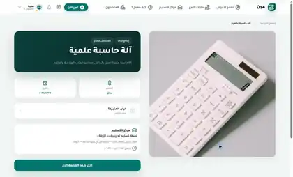
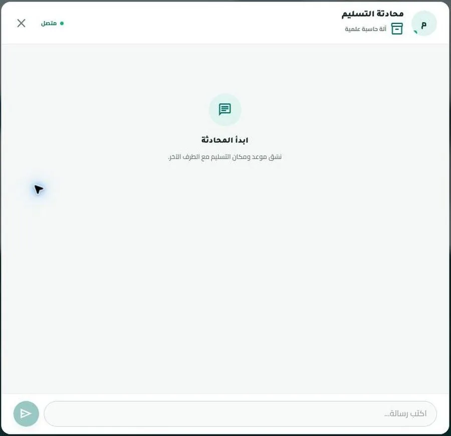
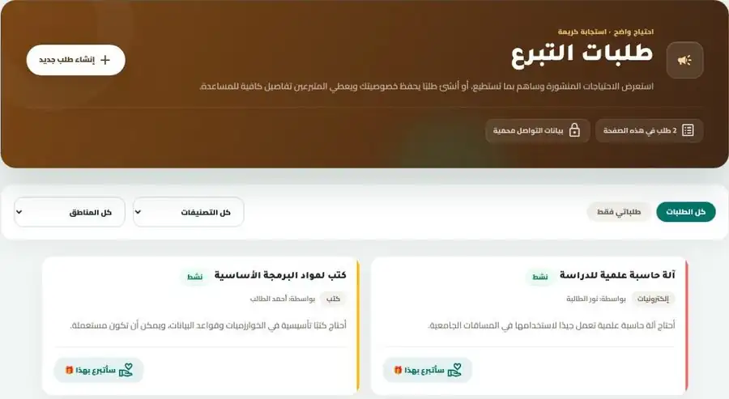
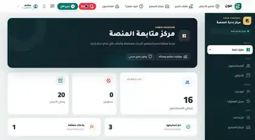

# عون | Aoun

**واجهة المستخدم لمنصة عون لتنسيق التبرعات العينية.**

عون منصة عربية تساعد على تنظيم رحلة التبرع العيني من عرض الغرض أو نشر الاحتياج، مرورًا بالحجز والتواصل، وحتى تأكيد التسليم والتقييم.

هذا المستودع يحتوي على تطبيق الويب المبني باستخدام **Next.js + React + TypeScript**.


[](https://github.com/abuhager/Aoun-Project_FrontEnd/actions/workflows/ci.yml)

## روابط المشروع

- **Live Application:** https://www.aoun.website/
- **Backend Repository:** https://github.com/abuhager/Aoun-Project_BackEnd

> المشروع حاليًا MVP منشور. البيانات والحسابات ونقاط التسليم المستخدمة لأغراض العرض والاختبار لا تعني وجود شراكات مؤسسية فعلية.


## فكرة المشروع

قد تصبح عملية التبرع العيني مشتتة عندما يتم نشر الاحتياجات والأغراض والتنسيق بشأنها عبر قنوات منفصلة.

يهدف **عون** إلى جمع هذه الرحلة في نظام واحد يستطيع من خلاله المستخدم عرض غرض للتبرع أو نشر طلب احتياج، ثم إدارة الحجز والتواصل والتسليم والمتابعة من داخل المنصة.

عون مخصص **للتبرعات العينية** ولا ينفذ عمليات دفع أو جمع تبرعات مالية.

## الوظائف الرئيسية

### الحساب والمصادقة

- إنشاء الحساب وتسجيل الدخول.
- التحقق من البريد الإلكتروني باستخدام OTP.
- استعادة وتغيير كلمة المرور.
- إدارة الملف الشخصي والصورة.
- إدارة الجلسة وتجديد المصادقة مع الـBackend.
- دعم التحقق الهاتفي عند تفعيل الميزة من إعدادات البيئة.

### الأغراض والتبرعات

- استعراض الأغراض المتاحة.
- البحث والتصفية.
- إضافة غرض مع صورة وبياناته.
- إدارة أغراض المستخدم.
- حجز الغرض وإلغاء الحجز.
- دعم قائمة الانتظار.
- تأكيد التسليم من طرفي العملية.

### طلبات الاحتياج

- استعراض طلبات الاحتياج.
- إنشاء طلب جديد.
- إرسال عرض استجابة للطلب.
- إدارة العروض وقبولها أو رفضها أو سحبها.

### التواصل والمتابعة

- محادثات مرتبطة بالمعاملة.
- رسائل فورية عبر Socket.IO.
- عداد للرسائل غير المقروءة.
- إشعارات داخل المنصة.
- تقييم بعد اكتمال عملية التسليم.

### الإشراف

تتضمن الواجهة صفحات إدارية لإدارة أجزاء من النظام ومتابعة النشاط والبلاغات والإعدادات وفق صلاحيات المستخدم.

## جولة داخل النظام

### الحجز

ينقل الحجز الغرض من مجرد إعلان متاح إلى عملية مرتبطة بأطراف وحالة تسليم قابلة للمتابعة.



### المحادثة

بعد إنشاء المعاملة يستطيع الأطراف استخدام المحادثة المرتبطة بها لتنسيق عملية التسليم.



### طلبات الاحتياج

تدعم عون أيضًا نشر الاحتياج واستقبال عروض من المتبرعين بدل الاعتماد فقط على الأغراض المعروضة.



### لوحة الإدارة

توفر لوحة الإدارة واجهة لمتابعة النظام وتنفيذ العمليات المتاحة للمشرفين.



## التقنيات

| التقنية | الاستخدام |
|---|---|
| Next.js 16 | إطار تطبيق الويب والتوجيه وServer/Client Components |
| React 19 | بناء واجهة المستخدم والمكونات |
| TypeScript | الأنواع والتحقق أثناء التطوير |
| Tailwind CSS 4 | تنسيق وتصميم الواجهة |
| Axios | طلبات HTTP من أجزاء الواجهة |
| SWR | جلب البيانات وإدارة حالتها في الواجهة |
| Socket.IO Client | الاتصال الفوري مع الـBackend |
| Firebase | دعم مسار التحقق الهاتفي عند تفعيله |
| Playwright | اختبارات End-to-End |
| Node Test Runner | اختبارات العقود والانحدار |
| ESLint | فحص جودة الكود |

## متطلبات التشغيل

- Node.js `>= 20.19.0`
- npm
- نسخة عاملة من Aoun Backend

## التشغيل المحلي

```bash
git clone https://github.com/abuhager/Aoun-Project_FrontEnd.git
cd Aoun-Project_FrontEnd
npm ci
```

أنشئ ملف:

```text
.env.local
```

ثم اضبط عنوان الـBackend على البيئة المحلية.

```env
NEXT_PUBLIC_API_URL=http://localhost:5000
BACKEND_URL=http://localhost:5000
```

بعد ذلك:

```bash
npm run dev
```

يعمل Next.js افتراضيًا على:

```text
http://localhost:3000
```

## متغيرات البيئة

المتغيرات التالية مستخدمة في التطبيق أو أدوات الاختبار:

| المتغير | الوظيفة |
|---|---|
| `NEXT_PUBLIC_API_URL` | عنوان الـAPI المستخدم من المتصفح وSocket.IO |
| `BACKEND_URL` | عنوان الـBackend المستخدم من جانب الخادم |
| `SERVER_API_TIMEOUT_MS` | مهلة طلبات API المنفذة من الخادم |
| `NEXT_PUBLIC_AUTH_INIT_TIMEOUT` | مهلة تهيئة المصادقة |
| `NEXT_PUBLIC_AUTH_SAFETY_TIMEOUT` | مهلة أمان لتهيئة حالة الجلسة |
| `NEXT_PUBLIC_PHONE_VERIFICATION_ENABLED` | تفعيل واجهة التحقق الهاتفي |
| `NEXT_PUBLIC_FIREBASE_API_KEY` | إعداد Firebase للعميل عند استخدام Phone Auth |
| `NEXT_PUBLIC_FIREBASE_AUTH_DOMAIN` | Firebase Auth Domain |
| `NEXT_PUBLIC_FIREBASE_PROJECT_ID` | Firebase Project ID |
| `PLAYWRIGHT_BASE_URL` | عنوان التطبيق المستخدم في اختبارات Playwright |
| `DEMO_LOGIN_ENABLED` | تفعيل حسابات العرض التي يقرأها الخادم الداخلي للواجهة |

لا ترفع ملفات البيئة التي تحتوي على إعدادات خاصة أو بيانات اعتماد إلى Git.

## الاختبارات والتحقق

الأوامر المعرفة في المشروع:

```bash
npm run lint
npm run typecheck
npm test
npm run e2e
npm run e2e:ci
npm run verify
npm run build
```

`verify` يشغّل:

```text
lint → typecheck → test
```

اختبارات Playwright موجودة في `tests/`، وتستخدم `http://127.0.0.1:3000` افتراضيًا ما لم يتم تحديد `PLAYWRIGHT_BASE_URL`.

## بنية المشروع

```text
src/
├── app/          # صفحات ومسارات Next.js
├── components/   # مكونات واجهة المستخدم
├── config/       # إعدادات وFeature Flags
├── context/      # Auth وSocket وحالات مشتركة
├── hooks/        # React hooks مشتركة
├── lib/          # API clients وخدمات وأدوات مساعدة
└── types/        # TypeScript types

public/           # الملفات العامة
contracts/        # العقود المشتركة
test/             # اختبارات العقود والانحدار
tests/            # Playwright E2E
docs/             # وثائق المشروع ولقطات النظام
```

## ملاحظات تطويرية

الواجهة ليست تطبيقًا مستقلًا بالكامل؛ معظم الوظائف تحتاج إلى Aoun Backend.

تأكد أثناء التطوير من أن `NEXT_PUBLIC_API_URL` و`BACKEND_URL` يشيران إلى الخادم الصحيح، وأن إعدادات الـBackend تسمح بعنوان الواجهة ضمن CORS.

في بيئة الإنتاج يجب استخدام HTTPS للاتصال بالخدمات المنشورة.
